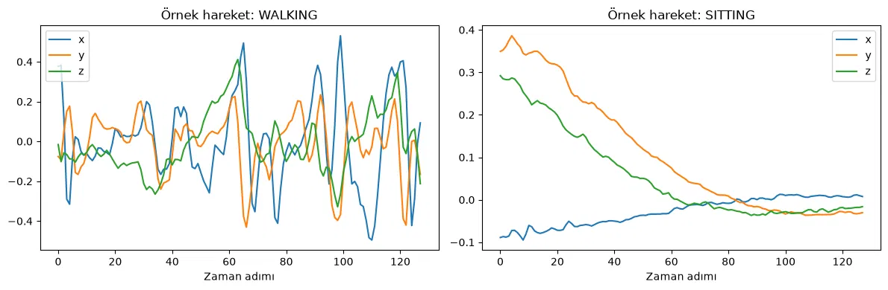
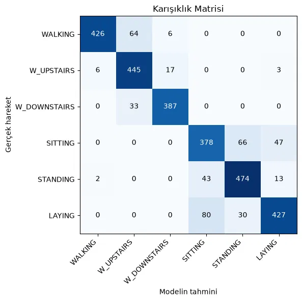
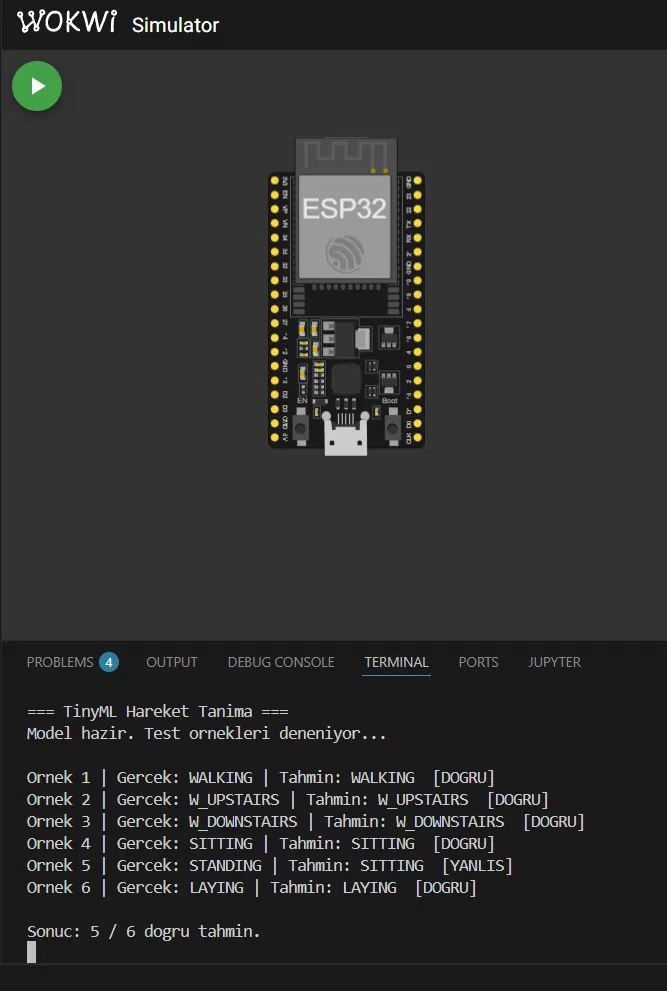

# TinyML — Hareket Tanıma (ESP32)

İvmeölçer ve jiroskop verisinden insan hareketini sınıflandıran, bir mikrodenetleyici (ESP32) üzerinde çalışan minik bir yapay zekâ modeli. Model bilgisayarda eğitilir, int8 kuantizasyonla küçültülür ve LiteRT for Microcontrollers (TensorFlow Lite Micro) ile çip üzerinde çalıştırılır — buluta bağlanmadan, yerel olarak.

## Amaç

Sınırlı belleğe sahip bir çipte (ESP32, 320 KB RAM) yerel olarak çalışan bir makine öğrenmesi modeli kurmak. Proje, makine öğrenmesi ile gömülü sistemleri uçtan uca birleştirir: veri işleme ve model eğitiminden, modelin küçültülüp gerçek bir çipe gömülmesine kadar tüm adımları içerir.

## Ne yapıyor?

Model, altı farklı hareketi tanır:

`WALKING` · `WALKING_UPSTAIRS` · `WALKING_DOWNSTAIRS` · `SITTING` · `STANDING` · `LAYING`

Girdi olarak 2.56 saniyelik bir hareket penceresini alır (128 zaman adımı × 6 kanal: 3 eksen ivmeölçer + 3 eksen jiroskop) ve bu altı sınıftan birini tahmin eder.

## Veri neye benziyor?

Aşağıda iki hareketin ham ivmeölçer sinyali görülüyor. Yürüme (WALKING) ritmik ve dalgalı bir desen çizerken, oturma (SITTING) sinyali durağan ve düzdür — model bu farkı öğrenerek sınıflandırma yapar.



## Boru hattı

```
Ham veri (UCI HAR)
   → Model eğitimi (Conv1D)
   → int8 kuantizasyon (float → tam sayı)
   → C dizisine dönüştürme (model_data.h)
   → ESP32'ye gömme (PlatformIO + Wokwi)
   → Gerçek zamanlı tahmin
```

## Sonuçlar

| Aşama | Değer |
|---|---|
| Model boyutu | 3.126 parametre (~12 KB) |
| Doğruluk (float32) | %86 |
| Doğruluk (int8 kuantize) | %81 |
| ESP32 RAM kullanımı | %14.6 (47.936 / 327.680 bayt) |
| ESP32 Flash kullanımı | %39.2 (513.261 / 1.310.720 bayt) |

### Karışıklık matrisi



Model, hareketli sınıfları (WALKING, UPSTAIRS, DOWNSTAIRS) yüksek doğrulukla tanır. En zorlandığı ayrım durağan hareketler arasındadır (SITTING / STANDING / LAYING) — bunlar ivmeölçer ve jiroskop açısından birbirine benzediği için beklenen bir karışıklıktır.

## Çip üzerinde canlı test

Her hareket sınıfından birer gerçek test örneği ESP32'ye verildi. Model 6 örneğin 5'ini doğru sınıflandırdı.



Tek hata `STANDING → SITTING` karışıklığıydı — bu, modelin karışıklık matrisinde de görülen bilinen zayıf noktası. Yani hata rastgele değil, beklenen bir sınıf karışıklığıdır ve modelin çipte, masaüstündekiyle tutarlı davrandığını gösterir.

## Öne çıkan teknik kararlar

- **Jiroskop eklemek doğruluğu %79'dan %86'ya çıkardı.** İlk model sadece ivmeölçer (3 kanal) kullanıyordu ve SITTING/STANDING'i ciddi şekilde karıştırıyordu. Karışıklık matrisi analiziyle bu tespit edildi; jiroskopun (vücut açısı bilgisi) eklenmesi bu karışıklığı büyük ölçüde çözdü.
- **`GlobalAveragePooling` mimarisi modeli 10 kat küçülttü.** `Flatten` yerine bu katman kullanılarak model 32.678 parametreden 3.126 parametreye indi — hem daha küçük hem daha iyi genelleşen bir model.
- **int8 kuantizasyonun bedeli dürüstçe raporlandı.** Kuantizasyon doğruluğu %86'dan %81'e düşürdü. Kalibrasyon iyileştirmesi denendi ancak kaybın modelin küçük boyutundan (int8'e hassasiyet) kaynaklandığı görüldü — TinyML'in temel boyut/doğruluk ödünleşimi.

## Veri seti

[UCI HAR (Human Activity Recognition Using Smartphones)](https://archive.ics.uci.edu/dataset/240/human+activity+recognition+using+smartphones) — 30 gönüllünün bel telefonu ivmeölçer ve jiroskop kayıtları. 7352 eğitim, 2947 test örneği.

Veri seti repoya dahil değildir (boyutu büyük). Kaynağından indirip \`data/UCI HAR Dataset/\` klasörüne yerleştirin.

## Klasör yapısı

\`\`\`
├── notebooks/
│   ├── 01_veri_kesif.ipynb      # veri yükleme ve görselleştirme
│   ├── 02_model_egitim.ipynb    # model eğitimi (Conv1D)
│   └── 03_kuantizasyon.ipynb    # int8 kuantizasyon + C dizisine dönüştürme
├── model/                        # eğitilmiş ve kuantize model dosyaları
├── firmware/                     # üretilen model_data.h (C dizisi)
├── wokwi_hareket/                # ESP32 firmware (PlatformIO + Wokwi)
│   ├── src/
│   │   ├── main.cpp              # çip üzerinde çalışan tahmin kodu
│   │   ├── model_data.h          # modelin C hali
│   │   └── test_ornekleri.h      # test hareket örnekleri
│   ├── platformio.ini            # PlatformIO yapılandırması
│   ├── wokwi.toml                # Wokwi simülasyon ayarı
│   └── diagram.json              # devre tanımı (ESP32)
├── docs/                         # README görselleri
├── requirements.txt
└── README.md
\`\`\`

## Kullanılan teknolojiler

**Makine öğrenmesi:** Python, TensorFlow / Keras, TensorFlow Lite (int8 kuantizasyon)
**Gömülü:** C++, ESP32, PlatformIO, TensorFlowLite_ESP32 (LiteRT for Microcontrollers), Wokwi (simülasyon)

## Nasıl çalıştırılır?

**Model eğitimi (bilgisayarda):**
\`\`\`bash
python -m venv venv
venv\Scripts\activate           # Windows
pip install -r requirements.txt
\`\`\`
UCI HAR veri setini \`data/\` klasörüne yerleştirin, ardından \`notebooks/\` altındaki not defterlerini sırayla çalıştırın.

**Firmware (ESP32 simülasyonu):**
PlatformIO ile \`wokwi_hareket/\` klasörünü derleyin (\`pio run\`), ardından Wokwi ile simüle edin. Seri monitörde her test örneği için tahmin sonucu görüntülenir.

## Geliştirilebilecek yönler

- Doğruluk, öznitelik mühendisliği veya daha derin bir mimariyle artırılabilir (bu projede çipe gömme önceliklendirildi).
- Gerçek bir ESP32 + IMU sensörü ile canlı, gerçek zamanlı hareket tanıma demosu eklenebilir.
- Model, daha fazla hareket sınıfı içerecek şekilde genişletilebilir.
